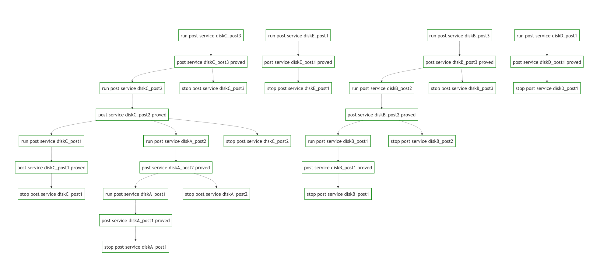

# Introduction

This guide aims to demonstrate the setup of multiple post services using go-spacemesh. It assumes familiarity with the setup and employs a standalone network for ease of illustration.

Using a similar setup for a production environment is feasible, but that's not the purpose of this guide.

We will create a simple network topology for the post services and then construct a directed acyclic graph (DAG) to manage the post services.

# 1:n post service guide with a standalone network

## Prerequisites

1. A Linux or MacOS system. This guide has not been tested on Windows.
2. [go-spacemesh](https://github.com/spacemeshos/go-spacemesh/releases) version 1.4.0-alpha.3 or later, unzipped and located in the `./go-spacemesh` directory beside the `config.json` file. This file is the configuration for the node in the standalone setup and is tailored for this demonstration.
3. [postcli](https://github.com/spacemeshos/post-rs/releases) version 0.7.1 or later in the `./postcli` directory.
4. [dagu](https://github.com/dagu-dev/dagu/releases) version 1.12.9 or later available in the `./dagu` directory.

## Standalone network

We will operate a network with epochs lasting 15 minutes, layers that last for 1 minute, with a poet cycle gap of 5 minutes and a phase shift of 10 minutes.

Please note that in standalone mode, the poet works within the same process as the node, which might lead to occasional 100% usage of one CPU core.

The only parameter not pre-set in the config is the genesis time. Ideally, set this time a little into the future to allow for preparation of the post services for the first epoch. For this guide, we will set it as `2024-03-08T14:30:00Z`

# The setup

## Dagu setup

As we touched on in the introduction, we will use DAGU to coordinate the post proving processes.

1. Start dagu with the following command while in the `dagu` directory:

```
./dagu server -d dags
```

By default, the Dagu UI will be accessible at `http://localhost:8080`

## Post initialization and node setup

1. Start the node using the following command:

```
./go-spacemesh -c config.json --preset=standalone --genesis-time=2024-03-08T14:30:00Z --grpc-json-listener 127.0.0.1:10095 -d ../node_data | tee -a node.log
```

2. Go to DAGU and execute the `init` DAG. It will set up the post data with `postcli`, retrieve the `goldenATX` from the node API, and copy the `identity.key` from each post data folder to the node data directory.
3. Confirm the initialization was successful by checking that the DAGU status for that DAG is `finished`.
4. Stop the node. This is necessary because the node does not reload keys from disk by design.
5. Remove the `local.key` file from the node data directory. The setup of multiple post services requires the deletion of the node's `local.key` file. The node will not start if this file is present.
6. Restart the node with the same command as in step 1 and keep it running.

### Setup description

In the `init.yaml` DAG, you'll notice we have set up 10 post directories. We've chosen this naming scheme to resemble a realistic scenario.

```
post/diskA_post1
├── identity.key
├── postdata_0.bin
└── postdata_metadata.json
... (similar structure for other post directories)
```

Imagine each `disk*` as a separate physical disk and each `_post*` as a separate post service operating on that disk.

We aim for a configuration where no more than one post service is proven at a time per disk and, at the same time, we are comfortable running all necessary post proving processes on different disks.

The DAG is a straightforward orchestration of post proving processes. It will execute post proving processes in the order we want, based on the dependencies we define.

> [!WARNING]
> This setup is meant for demonstration purposes only. There are other ways to achieve similar results, and this particular setup should not be employed in a production environment.

## Starting the post services

You can now go to DAGU and run the `proving` DAG. This will begin the initial post proving processes for each post service.

Upon successful execution, you'll see the resulting DAG as such:


The visualization clearly displays the dependencies and the sequence of the post proving processes.

Each post proving process represents an individual post service that is started when needed and stopped after fulfilling its purpose.

This demo is equipped with a `wait_for_cg` DAG that essentially waits for the poet's cycle gap to open (in a very naive manner; definitely not intended for production use) and then automatically triggers the `proving` DAG.
The `wait_for_cg` DAG functions only when the command `./dagu scheduler -d ./dags` runs alongside with `dagu server -d ./dags`. If you prefer not to run the scheduler, you can safely manually run the `wait_for_cg` DAG, or run the `proving` DAG when the cycle gap is available.

If you keep the `wait_for_cg` DAG running (and dagu scheduler) the post services will continue to prove every epoch.

# API and more

On the node side on `grpc-post-listener` you will find additional method: `spacemesh.v1.PostInfoService.PostStates` which returns the state of the post services.

Wherever the service is `IDLE` it means that the post service is not neede by node at the moment. The `PROVING` state means that the NODE expects post service to be proving. Which means:

- Wherever the state is `IDLE` you can shut down given post service, node does not need it anymore or yet. Nothing bad will happen if the post service remains connected to the node, but it's a waste of resources.
- Wheres the state is `PROVING` you should run the post service. However it's important to understand that you're free to orchestrate the post services as you wish. The moment you connect post service when node expects it to be `PROVING` the post service will stat proving process (with some small delay because of API calls etc).

Sample output:

```bash
grpcurl --plaintext localhost:10094 spacemesh.v1.PostInfoService.PostStates
{
  "states": [
    {
      "id": "rHQgcnqCBZE/gzjqqIpOtwVfYvrhkqP0toL4NcpDMzY=",
      "state": "IDLE",
      "name": "diskC_post3.key"
    },
    {
      "id": "nZW66vTRVDDD0CCChSSvNWWC7GArbFZPYc9Mm1EVwh4=",
      "state": "PROVING",
      "name": "diskA_post1.key"
    },
    {
      "id": "MkID511oMCESXfJSPiNNXdwUFn3xieAM8/fMKZJlXuY=",
      "state": "PROVING",
      "name": "diskB_post1.key"
    },
    {
      "id": "f6Y9rsTegmzFw1uu5cxwN62gzw0iurPhZvZVlHBRl+8=",
      "state": "PROVING",
      "name": "diskC_post1.key"
    },
    {
      "id": "8i7+8B3NoZ9pblqW4va6s9JPbupkJ03sA22Wi9eFJMY=",
      "state": "IDLE",
      "name": "diskC_post2.key"
    },
    {
      "id": "yPnJ+19oeqkBie7pD/flLxAYjwcPsjJwq4plDp/BaBs=",
      "state": "IDLE",
      "name": "diskB_post2.key"
    },
    {
      "id": "thyo/dndJANWWiVX6t9XrTrZb4D2KVUiconDkJOvsAc=",
      "state": "PROVING",
      "name": "diskA_post2.key"
    },
    {
      "id": "YQsPFR/rQD37omE9qXDAEQVrRBNRoSFgbMhnKFOF9NQ=",
      "state": "IDLE",
      "name": "diskD_post1.key"
    },
    {
      "id": "7kBK/uJcLUO8JnYTzoxBTYIhKksgep1GtQrTHGX2AxQ=",
      "state": "IDLE",
      "name": "diskE_post1.key"
    },
    {
      "id": "OMcoQmeBVpWqBgzW0UQPno377ymvunqmoVnpZdtoOCA=",
      "state": "IDLE",
      "name": "diskB_post3.key"
    }
  ]
}
```

You can also see in Events: `grpcurl -plaintext localhost:10093 spacemesh.v1.AdminService.EventsStream`

```bash
{
  "timestamp": "2024-03-11T15:48:16.759101Z",
  "help": "Node finished PoST execution using PoET challenge.",
  "postComplete": {
    "challenge": "zsw7v26gmJMUqfUpPUEAxAsDPO0cHtbYSnV8iAX2lBA=",
    "smesher": "nZW66vTRVDDD0CCChSSvNWWC7GArbFZPYc9Mm1EVwh4="
  }
}
```

As you can see `smesher` here points to the `id` behind the post service that was used to prove the PoST.

Please note that each of the post services exposes it's own API (`--operator-address`) which can be used to see the state of post-service itself:

```bash
# Not doing anything
❯ curl http://localhost:50051/status
"Idle"

# Proving
❯ curl http://localhost:50051/status
{"Proving":{"nonces":{"start":0,"end":128},"position":0}}

# Proving, read some data already
❯ curl http://localhost:50051/status
{"Proving":{"nonces":{"start":0,"end":128},"position":10000}}

# Started second pass
❯ curl http://localhost:50051/status
{"Proving":{"nonces":{"start":128,"end":256},"position":10000}}

# Finished proving, but the node has not fetched the proof yet
❯ curl http://localhost:50051/status
"DoneProving"
```

## How this demo differs from an actual production setup

### Dagu

While Dagu is small and easy to use, it might not be the best choice for a production environment. This really depends on your needs. Larger systems like Apache Airflow or Prefect have more features and integrations. But, they are also more complex and need more resources and expertise to manage.

You might also succeed with different type of tools like n8n, depending on your setup.

### Scripts in the `./scripts` folder

The scripts provided here are designed to simplify the demo.

In a Docker-based system, you might replace the `./scripts/run_service.sh` script with a `docker run ...` command, and `./scripts/stop_service.sh` with `docker stop ...`.

For setups across multiple hosts, like Kubernetes, you could schedule pods to handle the post services.

### No mTLS Setup

This demonstration presumes that everything operates on a single machine. In scenarios where the node exists within a different network (or for heightened security measures), the implementation of mutual TLS (mTLS) is recommended.

For configurations that utilize mTLS, one must set the `--address` on the post service to correspond with the address on which the `grpc-tls-listener` is listening.
